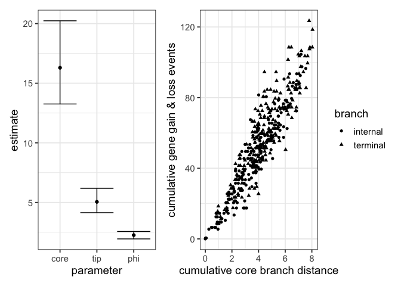
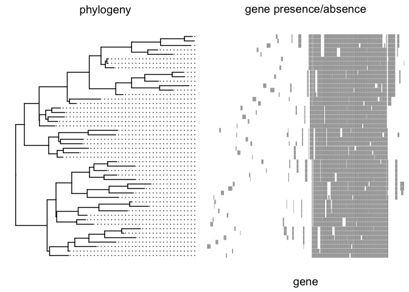

panstripe
================

<p align="center">

</p>

Panstripe improves the post processing of bacterial pangenome analyses.
In particular it aims to replace the dubious but popular pangenome
accumulation curve. The package is currently under development so
frequent changes are to be expected.

-   [panstripe](#panstripe)
    -   [Installation](#installation)
    -   [Quick Start](#quick-start)
    -   [Citation](#citation)
    -   [Comparing Pangenomes](#comparing-pangenomes)
    -   [Open vs Closed](#open-vs-closed)
    -   [Rate vs Size](#rate-vs-size)
    -   [Plots](#plots)
        -   [Pangenome fit](#pangenome-fit)
        -   [Tree with presence/absence](#tree-with-presenceabsence)
        -   [tSNE](#tsne)
        -   [Accumulation curves](#accumulation-curves)

<!-- README.md is generated from README.Rmd. Please edit that file -->
<!-- badges: start -->

[](https://github.com/gtonkinhill/panstripe/actions)
<!-- [](https://zenodo.org/badge/latestdoi/137083307) -->
<!-- badges: end -->

# panstripe

Panstripe improves the post processing of bacterial pangenome analyses.
In particular it aims to replace the dubious but popular pangenome
accumulation curve. The package is currently under development so
frequent changes are to be expected.

## Installation

`panstripe` is currently available on GitHub. It can be installed with
`devtools`

``` r
install.packages("remotes")
remotes::install_github("gtonkinhill/panstripe")
```

If you would like to also build the vignette with your installation run:

``` r
remotes::install_github("gtonkinhill/panstripe", build_vignettes = TRUE)
```

## Quick Start

Panstripe takes as input a phylogeny and gene presence/absence matrix in
Rtab format as is produced by
[Panaroo](https://gtonkinhill.github.io/panaroo/#/),
[Roary](https://github.com/sanger-pathogens/Roary),
[PIRATE](https://github.com/SionBayliss/PIRATE) and other prokaryotic
pangenome tools.

``` r
library(panstripe)
library(ape)

### NOTE: here we load example files from the panstripe package. You should replace
### these variables with the relevant paths to the files you are using.
phylo.file.name <- system.file("extdata", "tree.newick", package = "panstripe")
rtab.file.name <- system.file("extdata", "gene_presence_absence.Rtab", package = "panstripe")
### 

# Load files
pa <- read_rtab(rtab.file.name)
tree <- read.tree(phylo.file.name)

# Run panstripe
fit <- panstripe(pa, tree)
```

## Citation

To cite panstripe please use:

## Comparing Pangenomes

``` r
# Simulate a fast gene gain/loss rate with error
sim_fast <- simulate_pan(rate = 0.01, ngenomes = 100)
sim_slow <- simulate_pan(rate = 0.001, ngenomes = 100)

# Run panstripe
fit_fast <- panstripe(sim_fast$pa, sim_fast$tree)
fit_slow <- panstripe(sim_slow$pa, sim_slow$tree)

# Compare the fits
result <- compare_pangenomes(fit_fast, fit_slow)
result$summary
#> # A tibble: 2 x 5
#>   term  estimate std.error statistic  p.value
#>   <chr>    <dbl>     <dbl>     <dbl>    <dbl>
#> 1 tip     -0.269     0.110     -2.46 1.44e- 2
#> 2 core    -2.56      0.134    -19.1  1.00e-57
```

## Open vs Closed

The definition of what constitutes an open or closed pangenome is
somewhat ambiguous. We prefer to consider whether there is evidence for
a temporal signal in the pattern of gene gain and loss. This prevents
annotation errors leading to misleading results.

After fitting a panstripe model the significance of the temporal signal
can be assessed by considering the coefficient and p-value of the ‘core’
term in the model. The uncertainty of this estimate can also be
considered by looking at the bootstrap confidence intervals of the core
term.

Let’s simulate a ‘closed’ pangenome

``` r
sim_closed <- simulate_pan(rate = 0, ngenomes = 100)
fit_closed <- panstripe(sim_closed$pa, sim_closed$tree)

fit_closed$summary
#>     term     estimate    std.error     statistic   p.value bootstrap CI (2.5%)
#> 1    tip 21.761066718 2224.6606906  9.781746e-03 0.9922056          21.4638818
#> 2   core -0.008293472 4099.1708237 -2.023207e-06 0.9999984          -1.6378811
#> 3 height -0.043682061    0.0661098 -6.607501e-01 0.5095646          -0.2531633
#>   bootstrap CI (97.5%)
#> 1           22.0843254
#> 2            1.8226695
#> 3            0.1824206
```

``` r
plot_pangenome_fits(fit_closed)
```

<!-- -->

## Rate vs Size

Model parameters

``` r
sim_large <- simulate_pan(rate = 0.001, ngenomes = 100, mean_trans_size = 10)
sim_small <- simulate_pan(rate = 0.001, ngenomes = 100, mean_trans_size = 2)

fit_large <- panstripe(sim_large$pa, sim_large$tree)
fit_small <- panstripe(sim_small$pa, sim_small$tree)

plot_dist_params(list(large = fit_large, small = fit_small))
```

<!-- -->

``` r
plot_dist_params(list(fast = fit_fast, slow = fit_slow))
```

<!-- -->

## Plots

Panstripe includes a number of useful plotting functions to help with
interpretation of the output of panaroo.

### Pangenome fit

A simple plot of the fit of the model along with the input data points
can be made by running

``` r
plot_pangenome_fits(fit_fast)
```

<!-- -->

The `plot_pangenome_fits` function can also take a named list as input
allowing for easy comparisons between data sets

``` r
plot_pangenome_fits(list(fast = fit_fast, slow = fit_slow))
```

<!-- -->

### Tree with presence/absence

A plot of the phylogeny and the corresponding gene presence/absence
matrix can be made using the `plot_tree_pa` function. This function also
takes an optional vector of gene names to include in the plot.

``` r
# look at only those genes that vary
variable_genes <- colnames(pa)[apply(pa, 2, sd) > 0]

plot_tree_pa(tree = tree, pa = pa, genes = variable_genes, label_genes = FALSE, cols = "black")
```

<!-- --> \#\#\# Inferred
ancestral states

The `plot_gain_loss` function allows for the visualisation of the fitted
gene gain and loss events on the given phylogeny. The enrichment for
events at the tips of a tree is often driven by a combination of highly
mobile elements and annotation errors.

``` r
plot_gain_loss(fit)
```

<!-- -->

### tSNE

The tSNE dimension reduction technique can be used to investigate
evidence for clusters within the pangenome.

``` r
plot_tsne(pa)
```

<!-- -->

The [Mandrake](https://github.com/johnlees/mandrake) method can also be
used as an alternative to tSNE.

### Accumulation curves

While we do not recommend the use of accumulation curves as they do not
account for population structure, sampling bias or annotation errors we
have included a function to plot them to make it easier for users to
compare methods.

``` r
plot_acc(list(fast = sim_fast$pa, slow = sim_slow$pa))
```

<!-- -->
